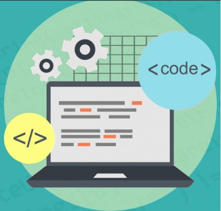

Software engineering 1 was a challenging but exciting class. Comparing this class to other classes that I’ve had in the past, this class was definitely more fast paced as we had to learn a new topic every week. We were challenged to work hard, and put in the time and effort towards learning the materials. There were also coding tests every week to see if we learned the materials thoroughly. That meant I had to put in about 6+ hours of studying every week. Learning on my own isn’t also my ideal way of learning, but I was able to manage through the class by studying and doing my best. I was able to get through this class by using the following learning styles.

## Development Environments 

Development Environment are programming tools to create coding applications. It helps developers create working codes by being able to test, debug, update, etc. by using the softwares. 

For this class we were required to use the IntelliJ software to code. I was unfamiliar with IntelliJ, but the more I used it, the more I became familiar with it. IntelliJ is almost like Visual Studio Code, a program that I’ve used in the past. It has a lot of features that have helped me with my coding skills. For example, IntelliJ has a feature, called Eslint that would check if you have clean code or not. This feature has helped me organize my code better for the future. IntelliJ also allows us to install packages such as Bootstrap. Bootstrap has made my life easier when creating and designing websites. 

Github desktop has also helped me significantly with my group project. The github desktop is such a smart and great application when it comes to creating group work codes. We are able to work on different parts of the project at the same time, then we are able to merge them into the main branch. It could detect lines of code that we might not be able to merge, or we could easily work on another issue by simply switching through the different branches. 

## Coding Standards

As I mentioned earlier IntelliJ has a feature called Eslint that would help achieve our coding standards. Coding standards are coding rules or guidelines that would visually help the software developers understand your code better. By following these standards, you are able to have a cleaner and quality code. Throughout this class, I was encouraged to follow these coding standards by using Eslint. I would say I have improved because I get less red squiggly lines, and more green checkmarks now.

## The Beginning of the End
In the end, I learned a lot during this course, in such a short amount of time. I will apply what I have learned in the future, and my coding skills have definitely improved. Becoming a website developer was one of my job choices, so I am glad that this class helped me take one step closer towards my goals.
