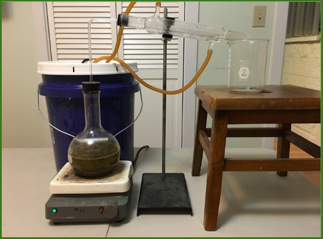
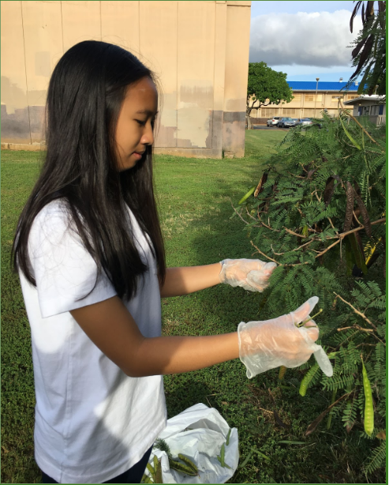

The Leucaena leucocephala or also known as the Haole Koa tree, is known to provide numerous benefits regarding its oil contents and biomass.These non-native plants produce huge quantities of seeds and are extremely fast-growing, thick skinned, and difficult to exterminate, making them a problem weed species that is able to adapt to numerous environments.The purpose of our project was to utilize the Haole Koa foliage as a means of biomass fuel. This project could be beneficial for the Hawaiian society because it is a potential source of renewable energy while having the environment grow less of the invasive plant. This invasive plant is a nuisance for the other living plants. In order to help reduce this problem, we propose that we collect legumes from the Leucaena pod as a means of bio-fuel through methanol extraction. We boiled the blended legumes in a flask, and extracted the oil content of it using a coffee filter. We were able to extract a decent amount of oil during our experiment, but we needed a large amount of legumes. Our experiment needed a lot of improvements and better materials because the amount of energy used to extract the oil outway the amount of oil we got during the experiment. 

We did a lot of research for this experiment, and my partner and I basically did everything together, from setting up the experiment, testing, gathering data, calculating the an	analysis, creating the poster board, presenting, etc. We presented our project at our school, then we were able to present at the districts, and finally at the Hawaii State Science and Engineering Fair.

I learned a lot while creating and presenting this project. I learned about invasive plants in Hawaii, specifically the Haole Koa tree. I was able to understand its benefits as well as its downsides. I understood how to extract oil from plants, and see if we are able to create oil from different materials because the oil we rely on right now is hurting our environment. I was able to present my project in three major presentations which really helped with my confidence, presentation skills, and answering skills. 

