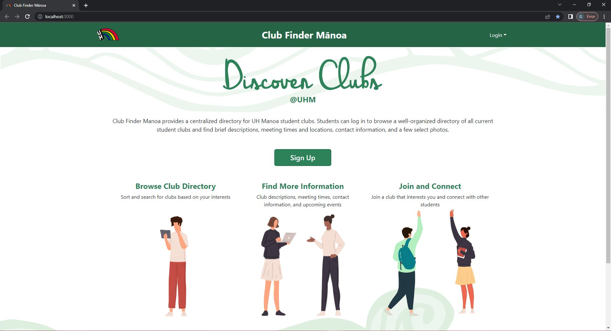
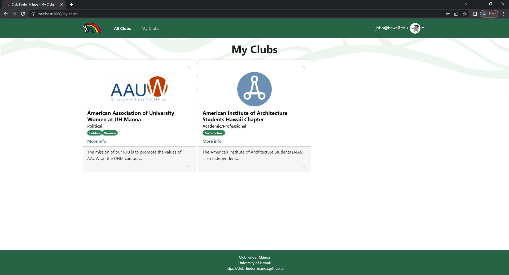
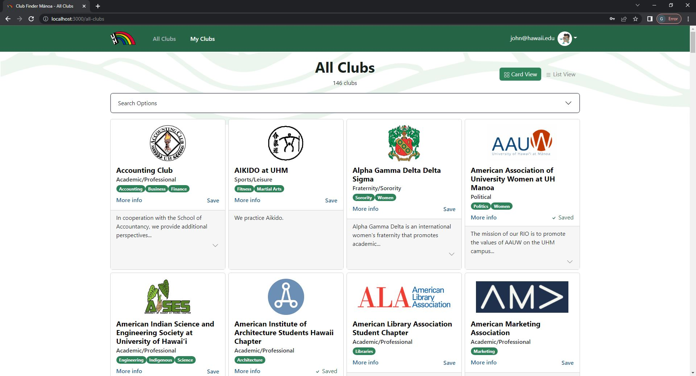
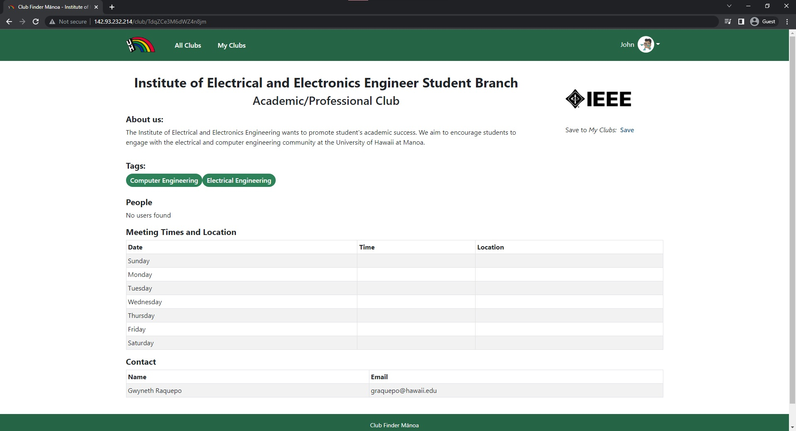
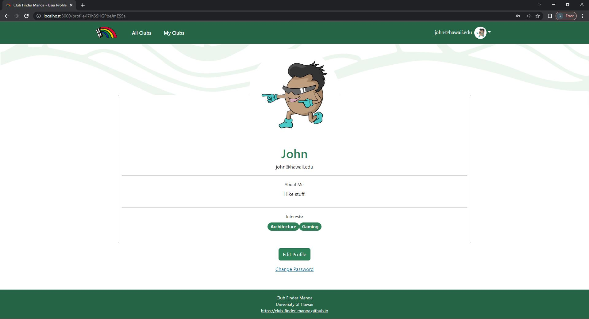
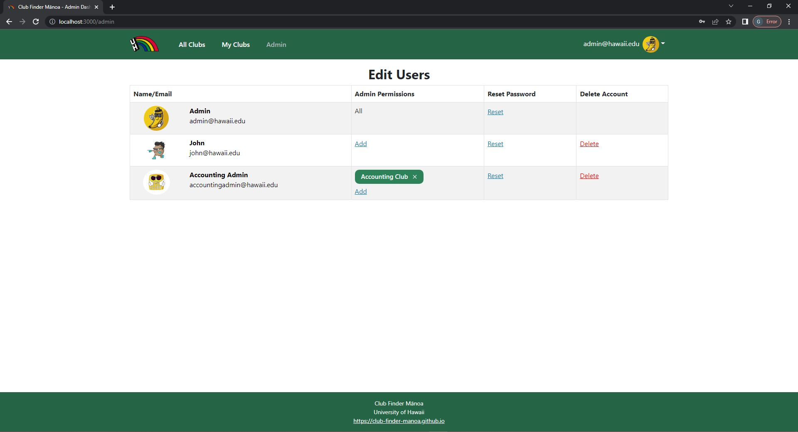

## **Overview**
<!-- Summarizes what the system does and what makes it special and different from other related applications -->

*The problem*: UH Manoa has over 200 Registered Independent Organizations, plus many more that do not have this “official” status but are nonetheless active organizations. Unfortunately, there is no easy way for students to learn what student clubs (both registered and unregistered) exist, what they do, and how to get further involved.

*The solution*: The Club Finder Manoa application will provide a centralized directory for UH Manoa student clubs. UH Manoa students can login to browse a well organized directory of all current student clubs, with brief descriptions, meeting times and locations, URLs to their websites (if any), contact information for officers, and a few select photos.

Club Finder Manoa has three user roles, all of whom login with their UH ID:
  - Regular users browse the directory and find clubs based on their interests
  - Club Admins have the ability to edit the data associated with their club
  - Super Admins make sure site content is appropriate and grant “club admin” privileges to selected users

The site will allow a user to browse the list of clubs in alphabetical order as well as filter by interest. For example, “athletic” clubs, “art” clubs, “music” clubs, etc. A club can belong to multiple interest areas, making it easier for users to find.

Users can specify interest areas, and be notified when a new club is created matching that interest area (or an existing club adds that interest area).

Visit the website here: <a href="http://142.93.232.214/"> Manoa Club Finder </a>

Learn more about the website here: <a href="https://club-finder-manoa.github.io/"> Manoa Club Finder Github </a>

### **My Role**

In this project was responsible for creating the profile page. The profile page cosists of a profile image, email, biography, and interests. You are able to edit the profile page and change all of the different components. You are also able to change the password in the profile page. Another thing that I was responsible for was creating the tests for each pages. The tests are needed in order to make a fully working website. Without it, we would not have been able to check for bugs in our code. I was able to create tests that would add or remove clubs from a page, edit the profiles, tests to see if all buttons are working, etc. I also helped debug any bugs that was on the pages. While working on the tests I encounter bugs, and I was able to help fix them. I also deployed our website into digital ocean. This meant that I had to manage the data for the website.

### **Landing Page**

  

### **My Clubs Page**

  

### **All Clubs Page**

  

### **Club Page**

  

### **Profile Page**

  

### **Admin Page**

  

## **My Overall Experience**
When I was in high school, I was in a coding class where we learned HTML, CSS, and Javascript. Near the end of the school year, we were responsible for creating a full working website with a group of 4 people. We had to create everything from scratch, from the website design to creating the functions of the pages. Comparing my experience of creating the Manoa Club Finder from creating the website back in highschool, I would say that they both enhanced my experience in creating a full on working website. The website that we are creating now is easier to compelete since we were provided with a template to begin with. We were given a shorter amount of time though. 
Looking at what we accomplished, I believe that this website could actually be usefull to UH Manoa students. If we were given the chance from UH Manoa to publish this website, I think that they would take it. I believe that the website has a lot more capabilities if we did more implementations in the future, but I think that right now, the website is a great beginner website where students could look for clubs, and add it to their profiles.

