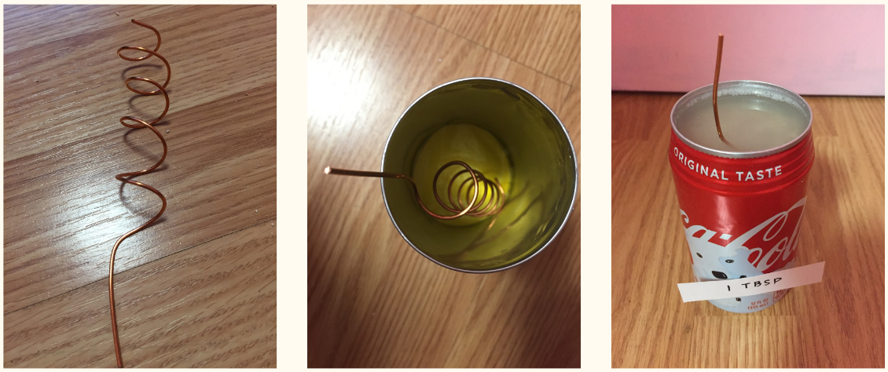

My idea for this science project was to create power using recycled materials more-so from soda cans, and copper wires. I created this because I wanted to reduce waste anywhere in the world, and specifically ocean waste. This could also reduce power bills, and create a better environment. I tested to see if salinity affected water waste by creating a soda can battery. I had a soda can that was cut open on the top, and I had sand, a copper wire in the middle, and salt water inside. I tested to see how much voltage was produced from the soda can battery, and it only produced a small amount of voltage. The idea was there, and it could benefit our environment by decreasing pollution and waste, especially from fossil fuels and carbon dioxide. 

This project was individual so I pretty much did everything, from research to creating the experiment. I also presented the project at my school, and it was a pretty nerve wracking and fun experience. 

I was able to gain a lot of knowledge about how batteries work, understand where power comes from, and how the power we use today affects our environment negatively. This project was definitely a great experience for me, and I was able to build up my presentation skills. At first, I was really nervous about presenting, especially to teachers and to the college of engineering faculty, but I am glad I had this experience. 
