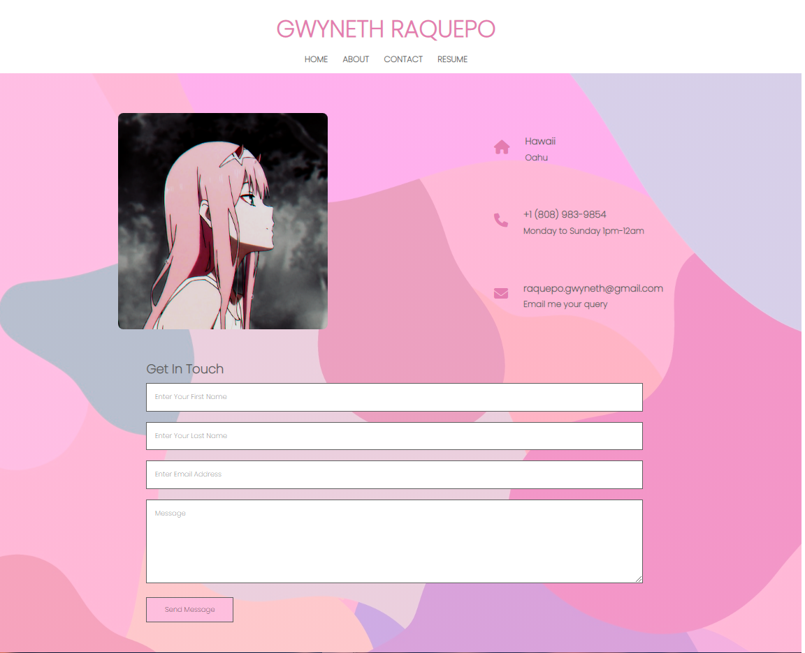

During my summer break, I decided to create a website for myself. I wanted to create a website because I thought it would be a great way to show companies my programming skills (HTML/CSS), and it’s way cooler than just a simple resume. I was also bored, and I wanted to freshen up my HTML and CSS skills before going back to school. My website is still in progress, and it’s not quite complete. I will need to program the contact information section, so that I am actually able to get data from users, and I still need to make it mobile friendly. I had a lot of fun creating the website and I was pretty happy to see it come alive. 

I created the website from scratch using visual studio code. I created the background image using procreate on my ipad. I coded using HTML and CSS, and I had a bit of help from watching a few youtube videos. 

It was pretty fun and exciting while I coded this. I did not expect myself to be coding during summer break. Maybe I was so bored that I was like why not code myself a website that would be beneficial for me in the future, and I did it! I am proud of myself, and I will continue to work on this website when I have time again. I learned a lot while coding this, and I definitely gained more knowledge of how to code in HTML and CSS.

